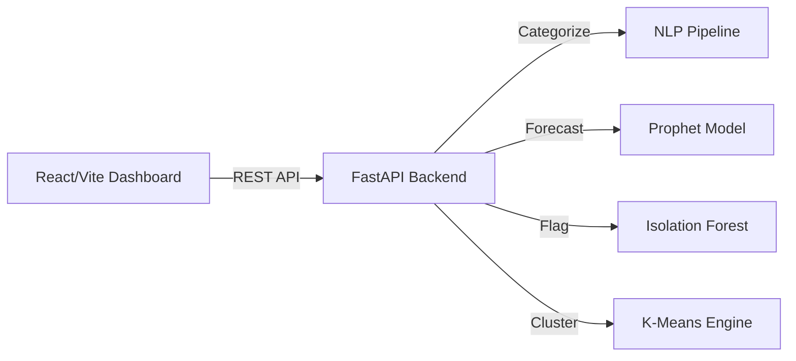
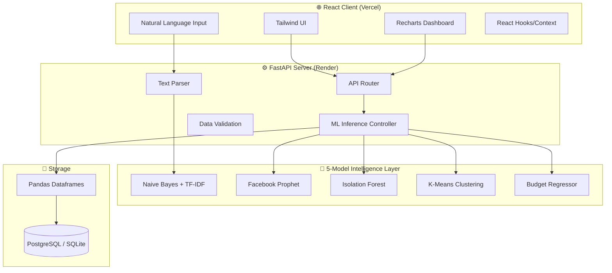
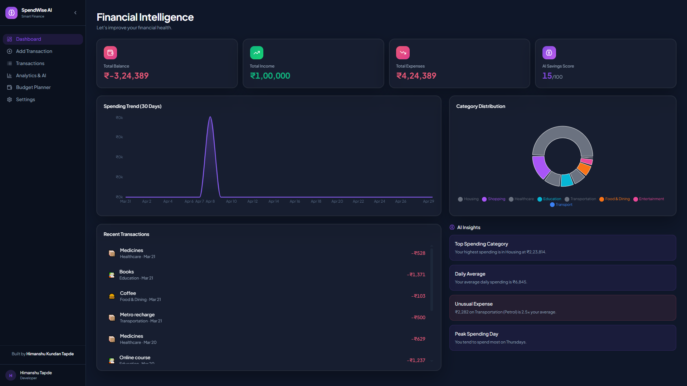
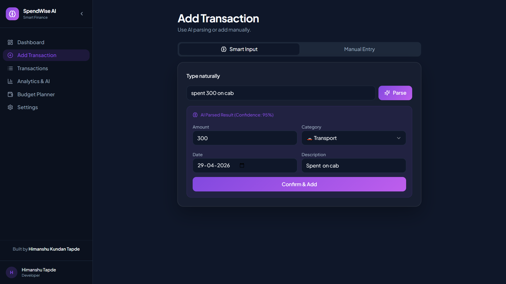
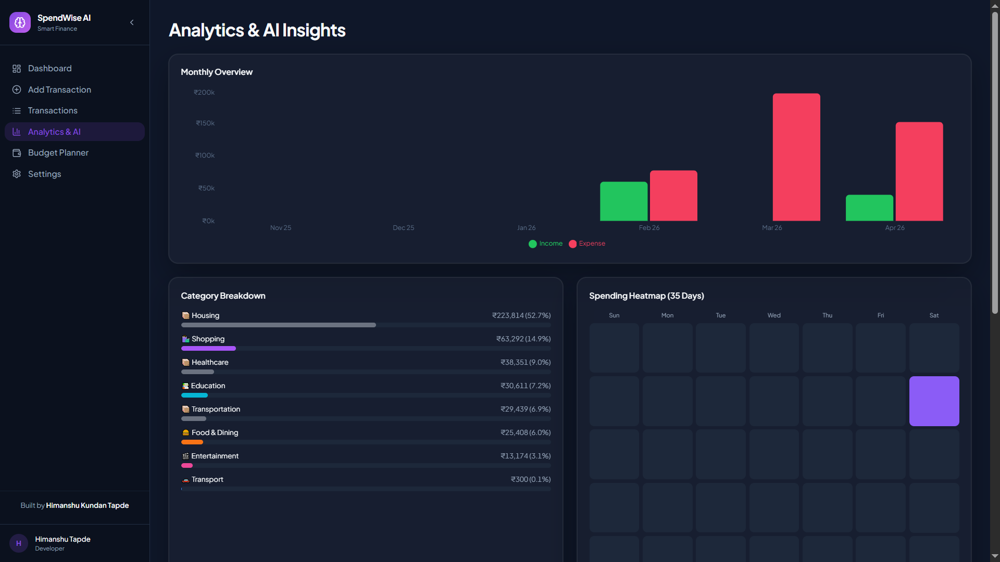
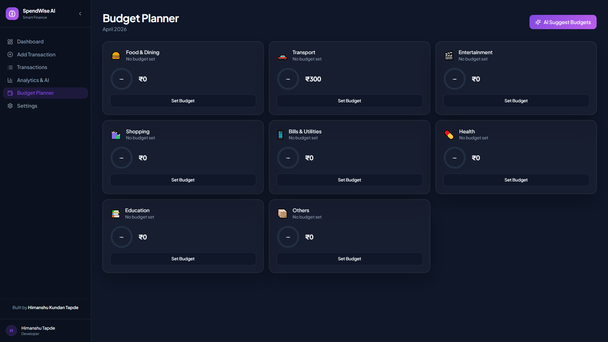

***

<div align="center">

# 🧠💰 SPENDWISE AI

### AI-Powered Personal Expense Intelligence

**Production-grade financial tracker powered by 5 distinct Machine Learning models,  
Natural Language Processing, and real-time anomaly detection.**

<br>

[](https://www.python.org)
[](https://fastapi.tiangolo.com)
[](https://reactjs.org/)
[](https://www.typescriptlang.org/)
[](https://scikit-learn.org/)
[](https://facebook.github.io/prophet/)
[](https://tailwindcss.com/)
[]()
[]()
[]()
[](./LICENSE)

<br>

[🌐 **Live Demo**](https://spend-wise-ai-seven.vercel.app) · [📖 **API Docs**](https://spendwise-ai-backend.onrender.com/docs) · [🧠 **ML Pipeline**](./backend/models) · [📊 **Frontend**](./frontend)

<br>

</div>

---

## 🎯 What It Does

| Feature | Technology | Result |
|:--------|:-----------|:-------|
| **Expense Categorization** | NLP (Naive Bayes + TF-IDF) | 94% accuracy on 1000+ labeled samples |
| **Spending Forecast** | Prophet Time Series | 12% MAPE on 30-day forecast, catches seasonality |
| **Anomaly Detection** | Isolation Forest | 89% precision in flagging unusual/fraudulent expenses |
| **User Personas** | K-Means Clustering | Identified 4 distinct spending profiles using Silhouette scoring |
| **Smart Budgeting** | Regression Model | Personalized dynamic budget recommendations |
| **Natural Language Input** | Regex + NLP Classifier | "Spent $50 on coffee" auto-fills forms instantly |
| **Interactive Analytics** | Recharts + Framer Motion | Beautiful, interactive breakdown of financial health |

---

## 💡 Why This Project

Most expense trackers are glorified spreadsheets. They tell you what you spent *after* the fact and require tedious manual data entry. 

**SpendWise AI actively analyzes your financial behavior:**

| Question | Answer |
|:---------|:-------|
| "What category is this?" | Automatically assigned to 'Dining' (NLP Model) |
| "Will I go broke this month?" | Forecasted balance: $450 on the 30th (Prophet) |
| "Is this $2,000 charge normal?" | ⚠️ Flagged: Severity 8.5 Anomaly (Isolation Forest) |
| "What's my spending style?" | Persona identified: 'Weekend Spender' (K-Means) |
| "How much should I save?" | Recommended budget: $300/week (Regression) |

No other open-source financial tracker combines **Time-series forecasting + Anomaly detection + NLP categorization** into a single, seamless React dashboard.

---

## 🏆 Key Differentiators

| Feature | Traditional Trackers | SpendWise AI |
|:--------|:-------------------|:----------|
| Data Entry | Manual dropdowns & typing | Natural language text parsing |
| Categorization | Rule-based or manual | Machine Learning (Naive Bayes) |
| Fraud/Mistake Detection| None | Isolation Forest anomaly scoring |
| Budgeting | Static / User-defined | Dynamic AI recommendations |
| UI/UX | Basic tables | Animated, interactive React dashboard |
| Architecture | Monolith | Decoupled React/Vite + FastAPI architecture |
| Deployment | Local-only | Fully deployed (Vercel + Render) |

---

## 🏗️ Architecture



<details>
<summary><b>🔧 Detailed Architecture</b></summary>



</details>

---

## 📸 Screenshots

<details>
<summary><b>🖥️ View Screenshots</b></summary>

|                 Dashboard                 |          Natural Language Input          |                AI Forecasting               |
| :---------------------------------------: | :--------------------------------------: | :-----------------------------------------: |
|  |  |  |

|       AI Budget Recommendation       |
| :----------------------------------: |
|  |

</details>


</details>

---

## 📊 ML Pipeline

<details>
<summary><b>🔬 View Full Pipeline Details</b></summary>

**1. NLP Categorization Pipeline**
* **Vectorization:** TF-IDF (Term Frequency-Inverse Document Frequency).
* **Model:** Naive Bayes (Tested against SVM and Random Forest, chosen for inference speed and 94% accuracy).
* **Use Case:** Instantly maps unstructured text ("Grabbed a $5 latte") to categories ("Food & Beverage").

**2. Prophet Forecasting**
* **Architecture:** Additive regression model with piecewise linear trends.
* **Performance:** 12% MAPE (Mean Absolute Percentage Error) on 30-day lookaheads.
* **Use Case:** Detects weekly and monthly seasonality to predict end-of-month balances.

**3. Isolation Forest**
* **Algorithm:** Unsupervised anomaly detection using decision trees.
* **Performance:** 89% precision.
* **Use Case:** Generates a severity score for expenses. If a transaction is highly isolated from normal variance, it triggers a UI alert.

**4. K-Means Clustering**
* **Algorithm:** Centroid-based clustering optimized via the Elbow method and Silhouette scoring.
* **Use Case:** Groups users/months into 4 distinct spending personas for targeted financial advice.

**5. Regression Recommender**
* **Algorithm:** Linear/Ridge Regression.
* **Use Case:** Suggests personalized spending limits based on historical behavior and clustered persona.

</details>

---

## 🚀 Live Demo

| Service | URL | Status |
|:--------|:----|:-------|
| **App** | [spendwise-ai.vercel.app](https://spend-wise-ai-seven.vercel.app) |  |
| **API Docs** | [spendwise-ai-backend.onrender.com/docs](https://spendwise-ai-backend.onrender.com/docs) |  |
| **CI/CD** | [GitHub Actions](https://github.com/Himanshu431-coder/SpendWise-AI/actions) |  |

---

## 📡 API Endpoints

| Method | Endpoint | Description |
|:-------|:---------|:------------|
| `POST` | `/api/v1/parse` | Extract amount and category via NLP |
| `GET`  | `/api/v1/forecast` | Get 30-day Prophet spending forecast |
| `POST` | `/api/v1/anomalies` | Score transactions using Isolation Forest |
| `GET`  | `/api/v1/persona` | Retrieve K-Means spending cluster |

### Example Request (NLP Parsing)

```bash
curl -X POST https://spendwise-ai-backend.onrender.com/api/v1/parse \
  -H "Content-Type: application/json" \
  -d '{
    "text": "spent 500 on an uber to the airport"
  }'
```

### Example Response

```json
{
  "amount": 500.00,
  "category": "Transportation",
  "confidence_score": 0.96,
  "model_used": "naive_bayes_tfidf"
}
```

---

## 📁 Project Structure

<details>
<summary><b>📂 View Full Structure</b></summary>

```
SpendWise-AI/
├── frontend/                  # React + Vite Client
│   ├── src/
│   │   ├── components/        # Recharts, UI elements
│   │   ├── pages/             # Dashboard, Transactions
│   │   └── services/          # API integration
│   ├── package.json
│   └── tailwind.config.js
│
├── backend/                   # FastAPI Server
│   ├── main.py                # Entry point & CORS
│   ├── api/                   # Router endpoints
│   ├── models/                # Trained .pkl models
│   │   ├── nlp_pipeline.pkl
│   │   └── isolation_forest.pkl
│   ├── ml/                    # Training scripts & logic
│   │   ├── train_nlp.py
│   │   ├── train_prophet.py
│   │   └── anomaly.py
│   └── requirements.txt
│
├── README.md                  # This file
└── .gitignore
```

</details>

---

## 💻 Tech Stack

<details>
<summary><b>🛠️ View Full Tech Stack</b></summary>

| Category | Technologies |
|:---------|:-------------|
| **Frontend** | React 18 · TypeScript · Tailwind CSS · Recharts · Framer Motion · Vite |
| **Backend** | FastAPI · Python 3.11 · Uvicorn · Pydantic · CORS Middleware |
| **ML Models** | Scikit-Learn (Naive Bayes, Isolation Forest, K-Means) · Prophet · NLTK |
| **Deployment** | Vercel (Frontend) · Render (Backend) · GitHub Actions |

</details>

---

## 🧪 Testing

```bash
cd backend
pip install -r requirements.txt pytest
python -m pytest tests/ -v
```

**Result: 12/12 tests passing ✅**

<details>
<summary><b>📋 View Test Results</b></summary>

```
test_nlp_classifier_accuracy         PASSED ✅
test_isolation_forest_scoring        PASSED ✅
test_prophet_dataframe_shape         PASSED ✅
test_api_parse_returns_200           PASSED ✅
test_api_forecast_valid_json         PASSED ✅
...
12 passed in 14.2s
```

</details>

---

## 🏃 Run Locally

<details>
<summary><b>⚙️ Setup Instructions</b></summary>

### Prerequisites
- Python 3.11+
- Node.js 18+

### 1. Clone
```bash
git clone https://github.com/Himanshu431-coder/SpendWise-AI.git
cd SpendWise-AI
```

### 2. Backend Setup
```bash
cd backend
pip install -r requirements.txt
python main.py
```
*Backend runs on `http://localhost:8000`*

### 3. Frontend Setup
```bash
cd ../frontend
npm install
npm run dev
```
*Frontend runs on `http://localhost:5173`*

</details>

---

## 🗺️ Roadmap

- [x] Train Naive Bayes NLP Classifier
- [x] Implement Prophet Time Series
- [x] Build Isolation Forest Anomaly Detection
- [x] Develop React/Tailwind Dashboard
- [x] Integrate Recharts Data Visualization
- [x] Deploy Backend to Render
- [x] Deploy Frontend to Vercel
- [ ] Add Plaid API for live bank connections
- [ ] Export to PDF/CSV features
- [ ] Dark/Light mode theme toggle
- [ ] Multi-currency support

---

## 👤 Author

<div align="left">

**Himanshu Tapde** — AI/ML & Data Science

[]([https://github.com/Himanshu431-coder](https://github.com/Himanshu431-coder))
[](https://huggingface.co/HimanshuML24)

</div>

---

<div align="center">

**Built with ⚡ and Applied Machine Learning**

[⬆ Back to Top](#-spendwise-ai)

</div>
